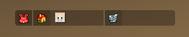

<h1 align="center">TextFontModifier</h1>
<div align="center">

[](/LICENSE.md)

</div>
<div align="center">
    
</div>

This plugin replaces font for actionbar, scoreboard (title included) and boss-bar texts.
Made this quite a while ago for Drag Championship (MCC recreation). Maybe someone might find this useful, dunno.

***Requires PaperMC and ProtocolLib!***

## Features
- Multiple font support
- Disable certain packets
- Custom "color code" for font switching
- Optional regex filtering
- Noxesium player head placeholders (bossbars, scoreboards, etc.) (v2.0.0-experimental only)
- Reload command (v1.2.0 only)

## Supported versions
In theory: **1.19**–**1.21.11**\
Tested versions: **1.19.2**, **1.20.2**, **1.21.3**, **1.21.11**

### **Version 2.0.0-experimental requires Java version 21!!!**

If you are using v2.0.0 on 1.19 version, you might see "Unsupported class file major version 65" error,
ignore it, the plugin will work anyway, and I won't bother to fix this.

## So, how does it work?

There's a packet listener and what it does is basically gets every text (in json) that is sent to the player and changes font property. This plugin might be resource-intensive, but there wasn't really a way for me to make it work in any other way on the event server I mentioned above.

## Usage
Just drop this plugin to your `/plugins/` folder, modify configuration and you are good to go.

## Commands (v1.2.0)
* **/textfontmodifier** or **/tfm** - reloads the plugin. 

## Configuration

New version now has migration (pretty useless ngl) from old configuration (v1.0.0/v1.0.1) to a new one (v1.1.1).

### Default config.yml (v1.2.0)
The difference from v1.1.2 and v1.2.0 is that in the newer version, `regex.value` can be empty (and by default is)
```yaml
fonts:
  default-font:
    name: namespace:key
    special-symbol: $u
regex:
  value: ''
  invert: false
packets:
  boss-bar:
    enable: true
    forced-font: default-font
  action-bar:
    enable: true
    forced-font: default-font
  scoreboard-title:
    enable: true
    forced-font: default-font
  scoreboard-scores:
    enable: true
    forced-font: ''
config-version: 1
```

<details>
  <summary>v1.0.1/v1.0.0 old config.yml</summary>

  ```yaml
  font: minecraft:key
  regex: '[\p{Print}&&[^~,],]+'
  invert-regex: false
  packets:
    boss-bar: true
    action-bar: true
    scoreboard-title: true
    scoreboard-scores: true
  special-symbol-for-scoreboards: $u
  ```
</details>

### Forced fonts
Forced font means that it will use that specific font only and special symbol won't work. **Note** that you need to specify configuration key and not actual font!

---

# Noxesium Player Heads (v2.0.0-experimental)

</div>
<div align="left">
    
</div>

This plugin can convert text placeholders into Noxesium player heads.
This is useful for systems that only support plain text (for example Skript bossbars).
Instead of creating components manually, you can simply place a placeholder inside the text.

## Placeholder format

```
<noxhead:UUID>
```

### Example:

```
<noxhead:3e7a89ee-c4e2-4392-a317-444b861b0794>
```

## Position and scale parameters
You can adjust head position or size.

```
<noxhead:UUID:y=-2>
<noxhead:UUID:x=1:y=-1>
<noxhead:UUID:y=-1:scale=0.9>
```

### Parameters:

| Parameter | Description |
|----------|-------------|
| `x` | Horizontal offset |
| `y` | Vertical offset |
| `scale` | Head scale |
| `hat` | Show hat layer |
| `slim` | Force slim skin model |

### Example:

```
<noxhead:3e7a89ee-c4e2-4392-a317-444b861b0794:y=-2:scale=0.9>
```

---

### What's a special symbol? (The default is `$u`)
The special symbol is a custom "color code" that replaces text's font. The font is changed until it crosses paths with another color (`$usome &ctext`, only `some` will get its font changed).

***Be aware*** that this does not really work as a real color code, in Minecraft, message is split by colors, so text `Hello &aWorld` will get split into two parts and this plugin does not create seperate part if `$u` is inserted in a middle of the word (e.g. `Hel$ulo`). That means that the symbol can be anywhere in the text (or text part as I explained 🤓), it will change the whole text's font. Do not try to insert the symbol between colors (`&a$u&b`), it's not going to work.

<div align="center">
    
</div>
